# RETAKE
메타버스 아카데미 1차 프로젝트(2022.6.27 ~ 2022.7.25)  

## 타겟 게임  
* **발로란트**  :  Player ref  
  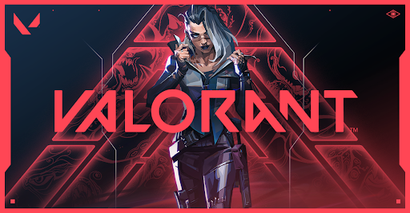  
* 니어:오토마타 : Enemy ref  
  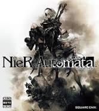

## 팀 구성 및 역할
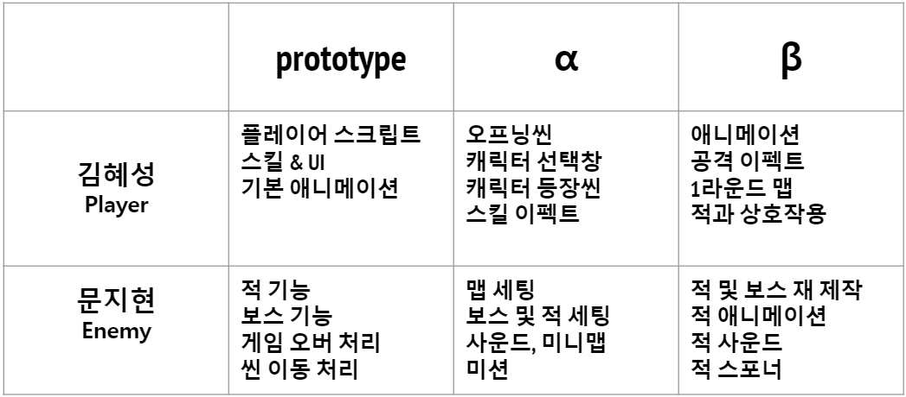  

## 게임 시퀀스
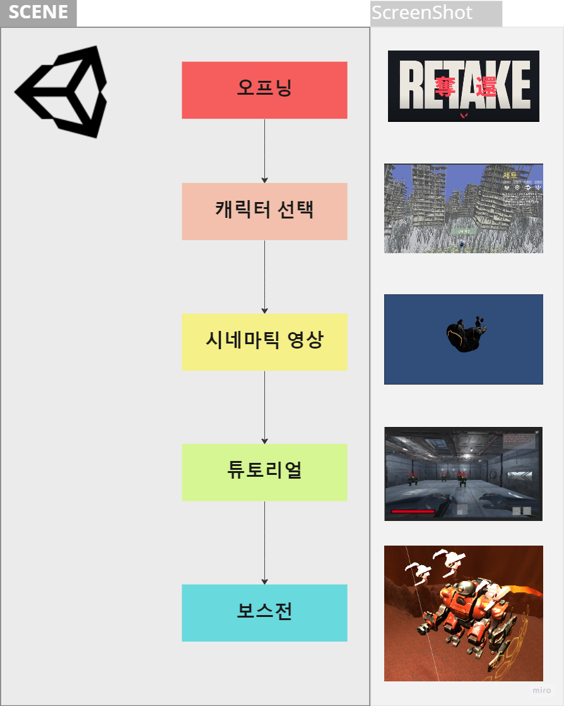  

----
# 주요 구현 요소(김혜성)

## 시네마틱 영상

* 오프닝 씬  
  </img>  
  * **UI 애니메이션**   
  </img> </img>    

* 시네마틱 영상  
  * **시네머신**  
  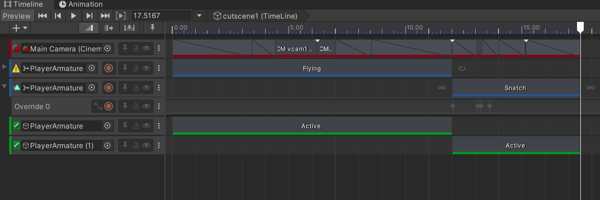</img>  
  
## 플레이어

* 플레이어 모델
  *  **[Mixamo](https://www.mixamo.com/)** : **Alien Soldier** 모델  
      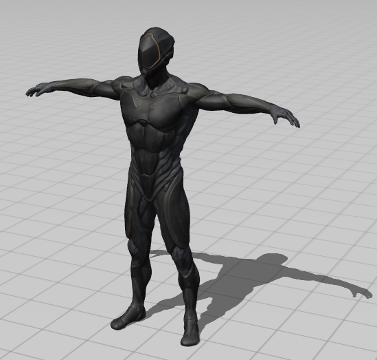</img>  
  * 카메라 및 파티클 Root 세팅  
    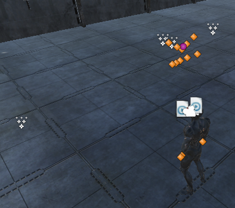</img>  

## 애니메이션 : Full Body 1인칭
  * **걷기&뛰기** : **Animator** Base Layer 

    *  **[Mixamo](https://www.mixamo.com/)** 에서 기본 애니메이션 찾아서 유니티 애니메이션 편집 툴 **[UMotion Pro](https://assetstore.unity.com/packages/tools/animation/umotion-pro-animation-editor-95991)** 사용하여 손 위치 커스텀  
      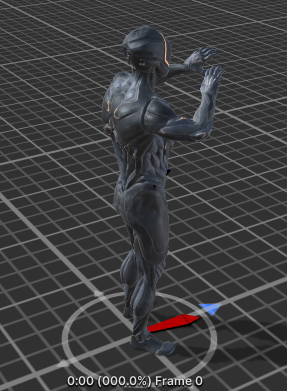</img>  
    * **Unity Blend Tree**
      * 자연스러운 애니메이션 전환  
       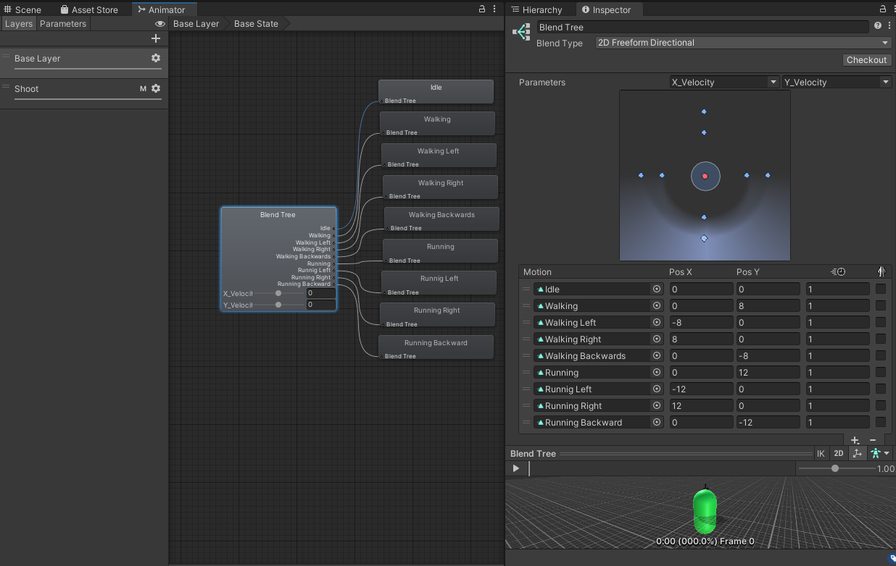</img>  
  * **스킬**  : **Animator** Attack Layer 
    * **참고 게임 영상** : 해당 영상을 프레임 단위로 끊어서 모션 분석  
       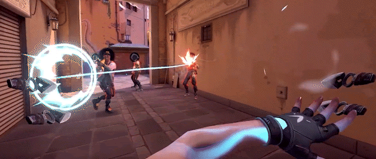</img>  
    * **[UMotion Pro](https://assetstore.unity.com/packages/tools/animation/umotion-pro-animation-editor-95991)** 사용하여 총 11가지 애니메이션 직접 제작  
      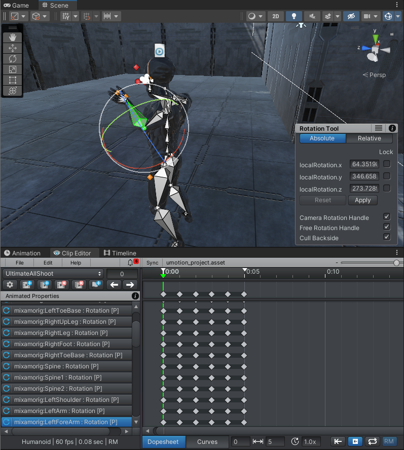</img>  
    
    * **Unity Avatar Mask**  
      * 스킬은 기본적으로 상체 애니메이션 -> 상체 애니메이션 마스크 사용  
      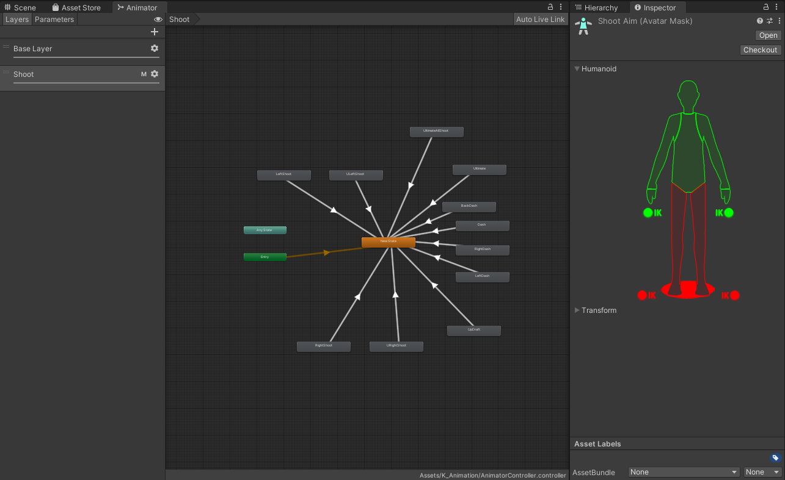</img>  

    * **스킬 종류**  
      * **대시** : 앞, 뒤, 좌, 우  

        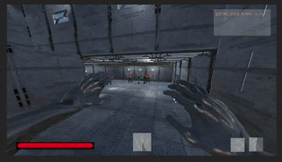</img> 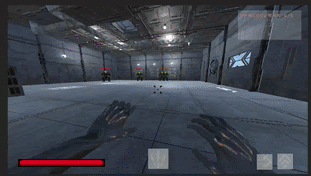</img> 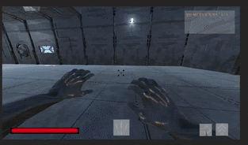</img> 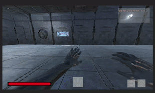</img>  
      * **도약**  
        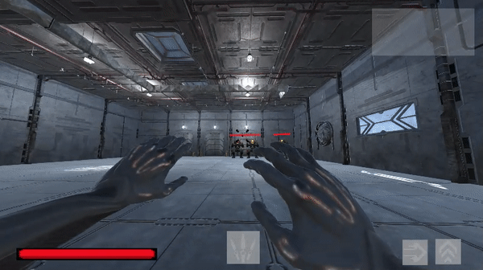</img>
      * **일반 공격**  : 양쪽 손 번갈아 공격 **콤보 시스템 적용**  

        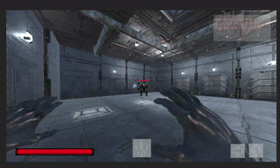</img> </img>  

      * **궁극기**  
        * 손에서 표창을 돌린뒤 5개의 표창이 플레이어 앞에 펼쳐지는 모션 구현  
        * 좌 클릭시 한발씩, 우 클릭시 남아있는 표창 모두 발사  

        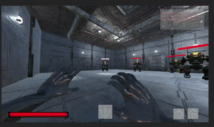</img> 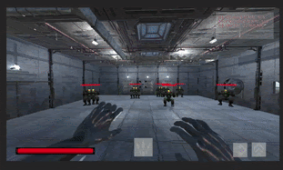</img>  
         
         

## 게임 로직 및 기능

* **K_PlayerController.cs**  
  *  **void HandleMovement()** : 걷기, 뛰기 및 해당 애니메이션 SetFloat 함수 기능 포함
  *  **void HandleJump()** : 점프
  *  **void CheckingGrounded()** : (bool)isGrounded 체크
  *  **void HandleMouseLook()** : 카메라 제어 
  
* **K_PlayerFire.cs**  
  *  **Main Function**  : Update()에서 사용자의 입력에 따라 일반 공격 및 공격 스킬 시전
      *  **void Attack()** : **일반 공격** 투사체 생성 위치 및 애니메이션, 공격 사운드 제어
      *  **UAttack()** : **궁극기** 공격 애니메이션(캐릭터), 사운드 제어
      *  **void HandleJettUltimateFire()** : **궁극기** 쿨타임, 시전동작 중 표창 위치, 발사시 표창 슬롯 제어   
  *  **Animation Event Function** : 공격 애니메이션과 공격 이펙트 싱크 일치, 스킬 연계, 딜레이, 콤보시스템 구현하기 위해 해당 기능 사용
      *  **void GeneralFire()** : **일반 공격** Raycast, 각종 이펙트 생성(발사, 투사체, 타격) 몬스터에게 데미지 적용, 콤보++
      *  **void UFire()** : **궁극기(한발씩 발사)** Raycast, 각종 이펙트 생성(발사, 투사체, 타격), 몬스터에게 데미지 적용, 콤보++
      *  **void UAllFire()** : **궁극기(남은 표창 모두 발사)** Raycast, 각종 이펙트 생성(발사, 투사체, 타격), 몬스터에게 데미지 적용  
      *  **void Combo() etc..** : 양손 번갈아가면서 공격 및 스킬 딜레이 제어  
      *  **void StartBulletAnim1() etc..** : 캐릭터 궁극기 시전 애니메이션에 따라  
          표창 돌리기 - 표창 5개 생성 및 일자로 펼치기 - 최종 발사 위치로 이동  
          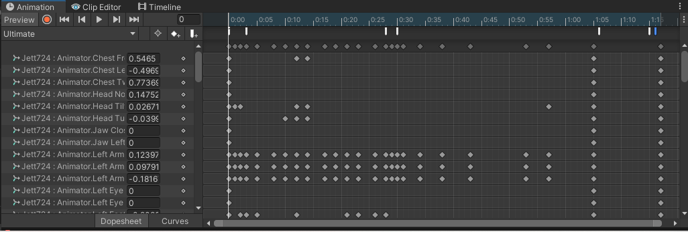</img>   
  *  **Sub Function** : Main Function과 Animation Event Function에 포함된 함수
      *  **void PlayAttackSound(int num)** : 사운드 pool[num] 재생 
      *  **IEnumerator SpawnTrail(TrailRenderer Trail, Vector3 HitPoint, Vector3 HitNormal, RaycastHit hit, bool MadeImpact)** :  
            void GeneralFire()에서 쏜 ray정보를 바탕으로 TrailRenderer 이동 및 타격 이펙트 생성
      *  **IEnumerator USpawnTrail(TrailRenderer[] uTrailPool, Vector3 HitPoint, Vector3 HitNormal, RaycastHit hit, bool MadeImpact)** :  
            void UFire()에서 쏜 ray정보를 바탕으로 TrailRenderer 이동 및 타격 이펙트 생성
      *  **IEnumerator UAllSpawnTrail(TrailRenderer[] uTrailPool, Vector3 HitPoint, Vector3 HitNormal, RaycastHit hit, bool MadeImpact, int num)** :  
            void UAllFire()에서 쏜 ray정보를 바탕으로 TrailRenderer 이동 및 타격 이펙트 생성, num은 남은 표창의 개수
  
* **K_JettController.cs**
  * **Main Function**  : Update()에서 사용자의 입력에 따라 제트 캐릭터 고유 유틸리티 스킬 사용  
      *  **void HandleDash()** : **대시** 스킬 제어  
      *  **void HandleUpdraft()** : **도약** 스킬 제어  
  * **Sub Function** : Main Function과 Animation Event Function에 포함된 함수
      *  **void OnStartDash()** : 대시 방향 설정, 쿨타임 및 대시 스킬 시전 시간 카운터 시작.  
      *  **void PlayDashParticle()** : 대시 방향에 따라 4가지 애니메이션 Play 및 4가지 파티클 생성.    
      *  **void OnEndDash()** : 카운터 초기화 및 대시 상태 false.  
      
       
      *  **void OnStartUpdraft()** : 도약 쿨타임 및 시전 시간 카운터 시작, 애니메이션 및 파티클 생성.  
      *  **void Updraft()** : jumpVelocity.y 을 변경하여 **K_PlayerController.cs**에서 **void HandleJump()**로 인하여 도약 스킬 발동  
      *  **void OnEndUpdraft()** : 카운터 초기화 및 도약 상태 false.  
  
* **K_PlayerStates.cs**  :  처음 게임 설계 때 캐릭터를 여러가지 만들 생각으로 공통 특성 설정(이동속도, 점프 높이, 중력)  
* **K_JettStates**  :  **제트** 고유 특성(스킬 관련 쿨타임, 시전시간 등)  
* **K_HeadShot.cs**  :  헤드샷 이펙트 생성  
* **AttackSoundGenerator.cs**  :  타격 사운드 List 관리  
* **K_PlayerHealth.cs**  :  플레이어 HP 관리  
* **K_SelectSceneManager.cs**  :  캐릭터 선택 UI 컨트롤러  
  *  **Button Event Function**  :  개별 UI 세트를 배열에 등록 후 버튼 클릭에 따라 반복문을 통해 활성화/비활성화      
      *  **void SelectCharacter1()**,  **void  ClickInfo()**,  **void ClickQ()**,  **void ClickE()**,  **void ClickV()**,  **void ConfirmClick()**  
* **K_1RScore.cs**  :  적 생성 및 점수 관리 스크립트    
  * **int CurScore** : 점수에 따라 사운드 및 미션 UI 관리  
  * **void GenerateEnemy()** :  각각 정해진 위치에 5마리 적 생성  

## 게임 시연 영상
* Youtube 링크  
  
  [](https://youtu.be/2o7Fp0KeJ1o)
  
## 개선 사항
* 애니메이션 이벤트 함수 의존성
  * 애니메이션 이벤트 함수 로 스킬 딜레이 및 연계를 제어하는데 의도치않게 모션이 캔슬되는경우(ex 벽으로 대시) 다음 스킬이 안나가는 버그 발생   
    * 시전 시간이 끝나면 관련 변수 초기화로 임시 해결  
* Enemy가 상속성이 없어서 상호작용에 있어서 복잡한 코드 작성  
  *  K_PlayerFire.cs  
      ```
      if (hit.collider.tag == "Enemy")
      {
          N_Enemy enemy = hit.transform.GetComponent<N_Enemy>();
          if (enemy != null)
              {
                  enemy.AddDamage(damage);

              }
          K_Enemy kenemy = hit.transform.GetComponent<K_Enemy>();
          if (kenemy != null)
          {
              kenemy.AddDamage(damage);

          }

          N_MiniBoss1 miniBoss1 = hit.transform.GetComponent<N_MiniBoss1>();
          if (miniBoss1 != null)
              {
                  miniBoss1.AddDamage(damage);
              }

          N_MiniBoss2 miniBoss2 = hit.transform.GetComponent<N_MiniBoss2>();
          if (miniBoss2 != null)
          {
              miniBoss2.AddDamage(damage);
          }
          N_Boss boss = hit.transform.GetComponent<N_Boss>();
          if (boss != null)
              {
                  boss.AddDamage(damage);
              }


      }
      ```  
      * 체력과 데미지를 가하는 함수는 모든 Enemy의 공통된 기능이기 때문에 상속성을 사용하면 해결 가능할 것으로 보임  

## License

[](https://opensource.org/licenses/MIT)

## Requirement

[Unity 2021.3.5f1 (LTS)](https://unity.cn/release-notes/lts/2020/2020.3.4f1)

