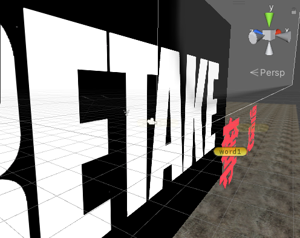
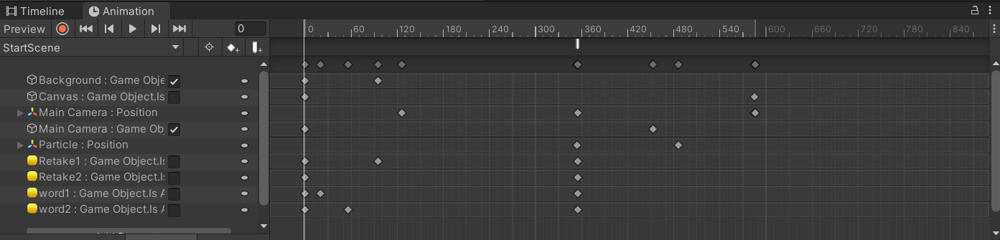

# RETAKE

## Requirement

[Unity 2021.3.5f1 (LTS)](https://unity.cn/release-notes/lts/2020/2020.3.4f1)

## Game logic and functionality

* 오프닝 씬  
  </img>  
  * **UI 애니메이션**  
  </img> </img>    

* Player models
  * All the original models and their animations were found from **[Mixamo](https://www.mixamo.com/)**, which is a pretty good game model website run by Adobe
    * **Policeman**: a policeman-like model with yellow skin
    * </img> </img> </img>

  * **Animations**:
    * **Walk** towards four different directions
    * **Run** towards four different directions
    * **Jump** without affecting upper part body (**achieved by unity3d body mask**)
    * **Shoot** without affecting lower part body (**achieved by unity3d body mask**)
    * **Unity Blend Tree**
      * This makes the player walk or run more naturally. It uses interpolation function to map different combinations of user input to different animations.
      * 

* Player movement
  * Walking
  * Jumping

* Bullet effects
  * Bullets hitting different materials will cause different effects
    * Wood
    </img>

## Script files

* **CameraRotation.cs**

### Input Devices

* Mouse and keyboard
  * The traditional way
  * Cheap and easy to use

## Contribution

## License

