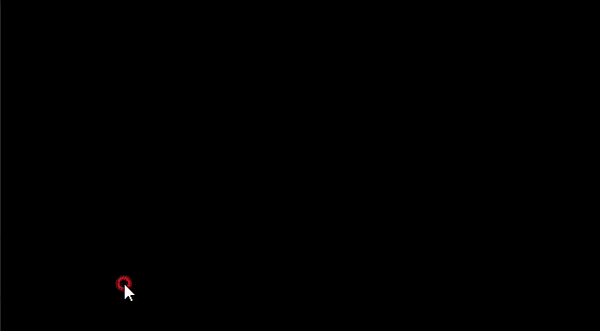

# RETAKE

## Requirement

[Unity 2021.3.5f1 (LTS)](https://unity.cn/release-notes/lts/2020/2020.3.4f1)

## Game logic and functionality

* 오프닝 씬  
  </img>  
  * **UI 애니메이션**  
  </img> </img>    

* 플레이어 모델
  *  **[Mixamo](https://www.mixamo.com/)**
      * **Alien Soldier**  
      </img>  

* **Animations**
    * **걷기&뛰기** 
    
      *  **[Mixamo](https://www.mixamo.com/)** 에서 기본 애니메이션 찾아서 유니티 애니메이션 편집 툴 **[UMotion Pro](https://assetstore.unity.com/packages/tools/animation/umotion-pro-animation-editor-95991)** 사용하여 손 위치 커스텀  
        </img>  
      * **Unity Blend Tree**
        * 자연스러운 애니메이션 전환  
         </img>  
    * **스킬**  
      * **[UMotion Pro](https://assetstore.unity.com/packages/tools/animation/umotion-pro-animation-editor-95991)** 사용하여 총 11가지 애니메이션 직접 제작  
        </img>  
      * **참고 이미지**  해당 영상을 프레임 단위로 끊어서 모션 분석  
         </img>  
      * **Unity Avatar Mask**  
        * 스킬은 기본적으로 상체 애니메이션 -> 상체 애니메이션 마스크 사용  
        </img>  

      * **스킬 종류**  
        * **대시** : 앞, 뒤, 좌, 우  
          
          </img> </img> </img> </img>  
        * **도약**  
          
          </img>
        * **일반 공격**  : 양쪽 손 번갈아 공격 **콤보 시스템 적용**  
          
          </img> </img>  
          
        * **궁극기**  
          * 손에서 표창을 돌린뒤 5개의 표창이 플레이어 앞에 펼쳐지는 모션 구현  
          * 좌 클릭시 한발씩, 우 클릭시 남아있는 표창 모두 발사  
         
            </img> </img>  
         
         
* Bullet effects
  * Bullets hitting different materials will cause different effects
    * Wood
    </img>

## Script files

* **CameraRotation.cs**

### Input Devices

* Mouse and keyboard
  * The traditional way
  * Cheap and easy to use

## Contribution

## License

